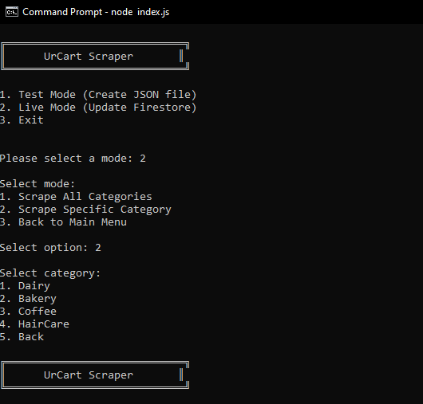
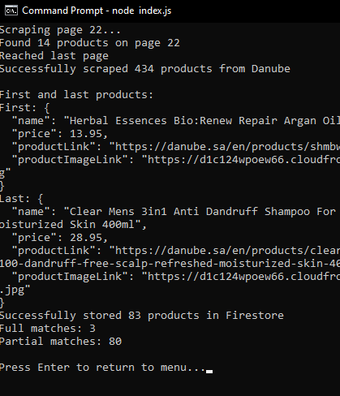

# UrCart Scraper

A web scraping CLI that automatically collects and compares product names across major Saudi supermarkets: Carrefour, Tamimi Markets, and Danube (more supermarkets can be added when scraper is implemented). The scraper matches identical products between stores and stores the data in Firebase, making it easy to track and compare prices.

## Features

- **Multi-Store Scraping**: Automatically scrapes product data from:
  - Carrefour KSA
  - Tamimi Markets
  - Danube
- **Smart Product Matching**: Matches identical products across different stores using name normalization
- **Firebase Integration**: Stores matched products in Firestore for easy access
- **Multiple Categories**: Supports different product categories
- **Price Comparison**: Tracks prices across stores
- **Periodic Updates**: Can run in live mode to update prices every 12 hours (can be changed in config.js file)
- **Test Mode**: Allows testing scraping functionality and saving results locally in .json format (results saved in scraped_data folder)

## Prerequisites

Before installing, make sure you have:

1. Node.js installed (v14 or higher)
2. A Firebase project set up
3. Firebase service account credentials (must be in root folder)

## Installation

1. Clone the repository:

```bash
git clone https://github.com/yourusername/urcart-scraper.git
cd urcart-scraper
```

2. Install dependencies:

```bash
npm install
```

3. Set up Firebase:

Create a Firebase project at Firebase Console
Generate a service account key from Project Settings > Service Accounts
Save the key as serviceAccount.json in the project root

4. Create a scraped_data directory in the project root:

```bash
mkdir scraped_data
```

## Configuration

The config.js file contains important settings:

Scraping intervals
Store URLs for each category
Browser configurations
Retry attempts

You can modify these settings according to your needs.

## Usage

Run the application:

```bash
node index.js
```

## CLI Example



**Output:**


